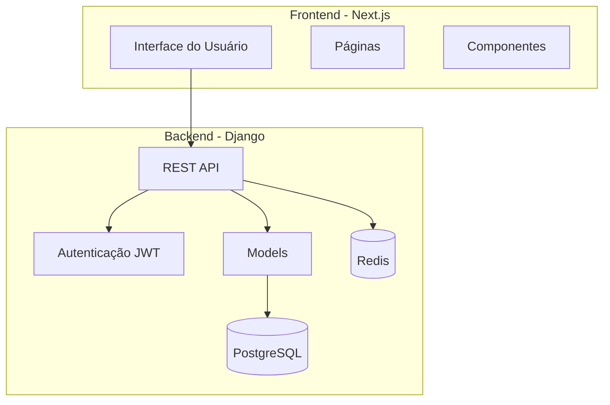
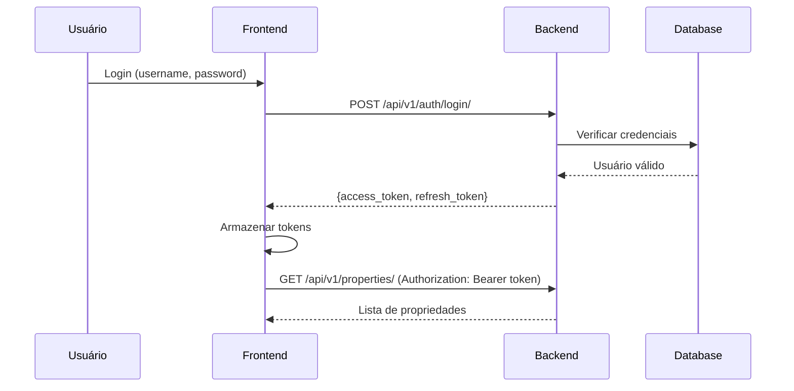
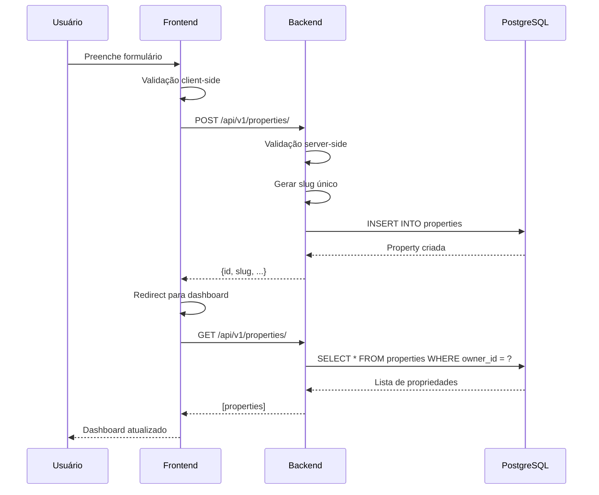
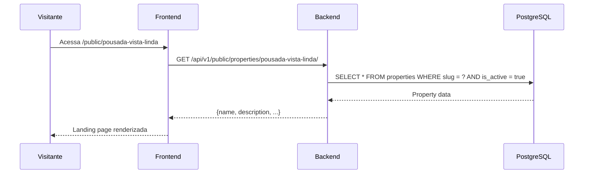

# Arquitetura do Sistema

## Visão Geral

O Hyfen é construído com uma arquitetura moderna de microserviços, separando claramente o backend (API) do frontend (interface do usuário).



## Camadas

### Frontend (Next.js 16)

- **App Router**: Roteamento baseado em arquivos
- **Server Components**: Renderização no servidor
- **Client Components**: Interatividade no cliente
- **API Integration**: Fetch com JWT

**Estrutura:**
```
frontend/
├── app/
│   ├── (auth)/          # Rotas de autenticação
│   ├── dashboard/       # Dashboard do proprietário
│   └── public/          # Landing pages públicas
├── components/          # Componentes reutilizáveis
└── lib/                 # Utilitários
```

### Backend (Django 5.1 + DRF)

- **REST API**: Django REST Framework
- **Autenticação**: SimpleJWT
- **ORM**: Django ORM
- **Soft Delete**: Deleção lógica

**Estrutura:**
```
backend/
├── core/               # Configurações do projeto
├── accounts/           # Gestão de usuários
├── properties/         # Propriedades e acomodações
└── bookings/           # Sistema de reservas
```

## Banco de Dados

### PostgreSQL 16

**Principais tabelas:**

- `accounts_user`: Usuários do sistema
- `properties_property`: Propriedades
- `properties_accommodation`: Acomodações
- `bookings_booking`: Reservas

### Redis 7

- Cache de sessões
- Cache de queries
- Rate limiting

## Autenticação

### JWT (JSON Web Tokens)



**Tokens:**
- **Access Token**: Válido por 60 minutos
- **Refresh Token**: Válido por 7 dias

## Fluxo de Dados

### Criação de Propriedade



### Visualização Pública



## Segurança

### Proteção de Rotas

**Frontend:**
- Middleware de autenticação
- Redirect para login se não autenticado
- Verificação de token expirado

**Backend:**
- `IsAuthenticated` permission class
- Filtro automático por owner
- Validação de permissões

### Dados Sensíveis

- Senhas hasheadas (PBKDF2)
- Tokens JWT assinados
- HTTPS obrigatório em produção
- CORS configurado

## Performance

### Otimizações

**Backend:**
- `select_related()` para ForeignKeys
- `prefetch_related()` para ManyToMany
- Índices em campos de busca
- Cache de queries frequentes

**Frontend:**
- Server-side rendering (SSR)
- Static generation quando possível
- Code splitting automático
- Image optimization

## Escalabilidade

### Horizontal

- Frontend: Deploy em CDN (Vercel)
- Backend: Múltiplas instâncias (Docker Swarm/Kubernetes)
- Database: Read replicas
- Cache: Redis Cluster

### Vertical

- Otimização de queries
- Connection pooling
- Async tasks (Celery)

---

**Arquitetura preparada para crescimento!** 🚀
